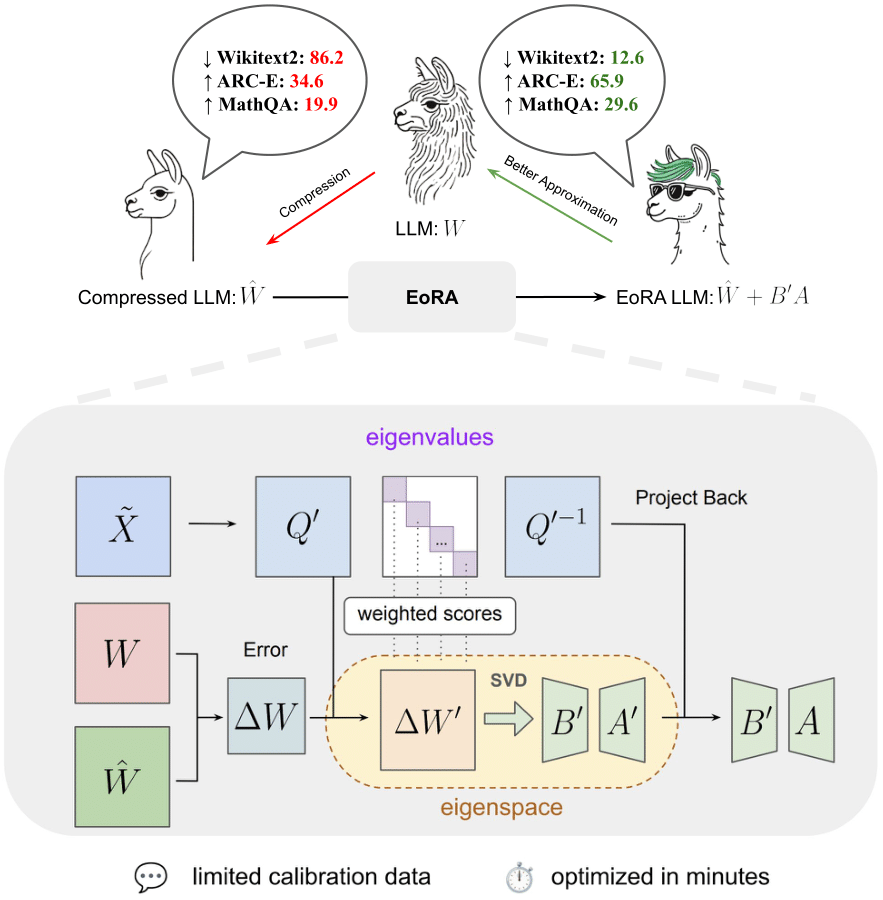

<h1 align="center">
    <p> EoRA: Fine-tuning-free Compensation for Compressed LLM with Eigenspace Low-Rank Approximation</p>
</h1>

<h1 align="center"> 
    
</h1>

# Code to reproduce the paper results will be released soon
# For compensating Quantized LLM with EoRA, please refer to GPTQModel [HERE](https://github.com/ModelCloud/GPTQModel), we will upload a comprenhensive documentation soon which also includes our EoRA kernel!


The Official PyTorch implementation of [**EoRA: Training-free Compensation for Compressed
LLM with Eigenspace Low-Rank Approximation**](https://arxiv.org/abs/2410.21271).

[](https://github.com/NVlabs/EoRA/stargazers)

[Shih-Yang Liu*](https://nbasyl.github.io/), [Maksim Khadkevich](https://hutm.github.io/main.html), [Nai Chit FUNG](https://www.linkedin.com/in/naichit/), [Charbel Sakr](https://sakr2.web.engr.illinois.edu/), [Chao-Han Huck Yang](https://research.nvidia.com/person/huck-yang),[Chien-Yi Wang](https://chienyiwang.github.io/), [Saurav Muralidharan](https://www.sauravm.com/), [Hongxu Yin](https://hongxu-yin.github.io/), [Kwang-Ting Cheng](https://seng.hkust.edu.hk/about/people/faculty/tim-kwang-ting-cheng), [Jan Kautz](https://jankautz.com/), [Yu-Chiang Frank Wang](http://vllab.ee.ntu.edu.tw/ycwang.html),  [Pavlo Molchanov](https://www.pmolchanov.com/), [Min-Hung Chen](https://minhungchen.netlify.app/) <br>
(*Work done during the internship at NVIDIA Research)

[[`Paper`](https://arxiv.org/abs/2410.21271)] [[`BibTeX`](#citation)]

EoRA projects the compression error into the eigenspace of input activations and performs low-rank approximation for compensating the compressed model.

For business inquiries, please visit our website and submit the form: [NVIDIA Research Licensing](https://www.nvidia.com/en-us/research/inquiries/).

## 💥 News 💥
- **[24.02.2025]** 🔥🔥 EoRA has been integrated into GPTQModel [HERE](https://github.com/ModelCloud/GPTQModel)!!


## Star History

[](https://star-history.com/#NVlabs/EoRA&Date)


## Contact
Shih-Yang Liu: [shihyangl@nvidia.com](shihyangl@nvidia.com) or [sliuau@connect.ust.hk](sliuau@connect.ust.hk)

## Citation
If you find EoRA useful, please consider giving a star and citation:
```bibtex
@article{liu2024eora,
  title={EoRA: Training-free Compensation for Compressed LLM with Eigenspace Low-Rank Approximation},
  author={Liu, Shih-Yang and Yang, Huck and Wang, Chien-Yi and Fung, Nai Chit and Yin, Hongxu and Sakr, Charbel and Muralidharan, Saurav and Cheng, Kwang-Ting and Kautz, Jan and Wang, Yu-Chiang Frank and others},
  journal={arXiv preprint arXiv:2410.21271},
  year={2024}
}
```

## Licenses
Copyright © 2024, NVIDIA Corporation. All rights reserved.

This work is made available under the NVIDIA Source Code License-NC. Click [here](https://github.com/nbasyl/DoRA/LICENSE) to view a copy of this license.

