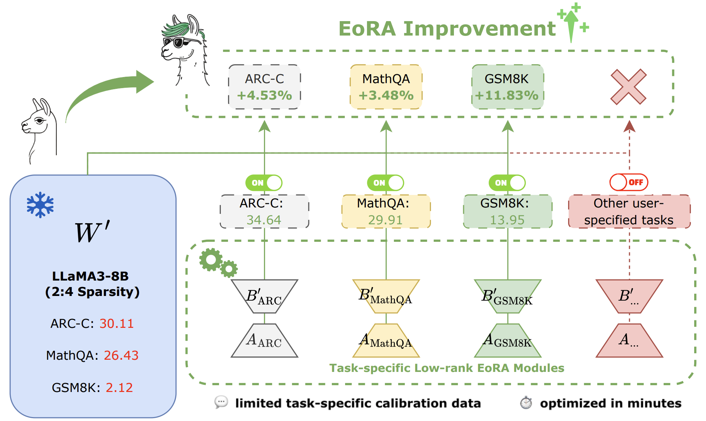

<h1 align="center">
    <p> EoRA: Fine-tuning-free Compensation for Compressed LLM with Eigenspace Low-Rank Approximation</p>
</h1>

<h1 align="center"> 
    
</h1>

# 🔧 **GPTQModel Support**
## EoRA is now seamlessly integrated into GPTQModel([HERE](https://github.com/ModelCloud/GPTQModel)), Check [here](https://github.com/ModelCloud/GPTQModel/tree/main/examples/eora) for detailed instructions on running EoRA with GPTQModel.

## 🛠 Installation
```
# clone repo
git clone https://github.com/ModelCloud/GPTQModel.git && cd GPTQModel

# pip: compile and install
# You can install optional modules like autoround, ipex, vllm, sglang, bitblas, and ipex.
# Example: pip install -v --no-build-isolation .[vllm,sglang,bitblas,ipex,auto_round]
pip install -v . --no-build-isolation
```
## ⚡ Quick Start
### Step 1: Quantize the model with GPTQModel
```py
from datasets import load_dataset
from gptqmodel import GPTQModel, QuantizeConfig

model_id = "meta-llama/Llama-3.2-3B"
quant_path = "Llama-3.2-3B-gptqmodel-4bit"

calibration_dataset = load_dataset(
    "allenai/c4",
    data_files="en/c4-train.00001-of-01024.json.gz",
    split="train"
  ).select(range(1024))["text"]

quant_config = QuantizeConfig(bits=4, group_size=128)

model = GPTQModel.load(model_id, quant_config)

# increase `batch_size` to match gpu/vram specs to speed up quantization
model.quantize(calibration_dataset, batch_size=1)

model.save(quant_path)
```
### Step 2: Generate EoRA given the quantized model 
```py
from gptqmodel.adapter.adapter import Lora
from gptqmodel import GPTQModel, QuantizeConfig

eora = Lora(
  # for eora generation, path is adapter save path; for load, it is loading path
  path=f"{quant_path}/eora_rank32", 
  rank=16,
)

# provide a previously gptq quantized model path
GPTQModel.adapter.generate(
  adapter=eora,
  model_id_or_path=model_id,
  quantized_model_id_or_path=quant_path,
  calibration_dataset=calibration_dataset,
  calibration_dataset_concat_size=0,
  auto_gc=False)

# post-eora inference
model = GPTQModel.load(
  model_id_or_path=quant_path,
  adapter=eora
)
```

### Step 3: Evaluate the accuracy of the original quantized model vs EoRA
#### Evaluting the original quantized model
```
python GPTQModel/examples/eora/evaluation.py --quantized_model quant_path
```
#### Evaluting EoRA
```
python GPTQModel/examples/eora/evaluation.py --quantized_model quant_path \
    --eora_save_path {quant_path}/eora_rank32 \
    --eora_rank 16
```


# Reproducing Paper Results
You can find full reproduction instructions in the [EoRA](https://github.com/NVlabs/EoRA/tree/main/EoRA) directory.


[](https://github.com/NVlabs/EoRA/stargazers)

[Shih-Yang Liu*](https://nbasyl.github.io/), [Maksim Khadkevich](https://hutm.github.io/main.html), [Nai Chit FUNG](https://www.linkedin.com/in/naichit/), [Charbel Sakr](https://sakr2.web.engr.illinois.edu/), [Chao-Han Huck Yang](https://research.nvidia.com/person/huck-yang),[Chien-Yi Wang](https://chienyiwang.github.io/), [Saurav Muralidharan](https://www.sauravm.com/), [Hongxu Yin](https://hongxu-yin.github.io/), [Kwang-Ting Cheng](https://seng.hkust.edu.hk/about/people/faculty/tim-kwang-ting-cheng), [Jan Kautz](https://jankautz.com/), [Yu-Chiang Frank Wang](http://vllab.ee.ntu.edu.tw/ycwang.html),  [Pavlo Molchanov](https://www.pmolchanov.com/), [Min-Hung Chen](https://minhungchen.netlify.app/) <br>
(*Work done during the internship at NVIDIA Research)

[[`Paper`](https://arxiv.org/pdf/2410.21271)] [[`BibTeX`](#citation)]

EoRA projects the compression error into the eigenspace of input activations and performs low-rank approximation for compensating the compressed model.

For business inquiries, please visit our website and submit the form: [NVIDIA Research Licensing](https://www.nvidia.com/en-us/research/inquiries/).

## 💥 News 💥
- **[24.02.2025]** 🔥🔥 EoRA has been integrated into GPTQModel [HERE](https://github.com/ModelCloud/GPTQModel)!!
- **[13.06.2025]** 🔥🔥 Release the code for reproducing the paper's results!!

## Star History

[](https://star-history.com/#NVlabs/EoRA&Date)


## Contact
Shih-Yang Liu: [shihyangl@nvidia.com](shihyangl@nvidia.com) or [sliuau@connect.ust.hk](sliuau@connect.ust.hk)

## Citation
If you find EoRA useful, please consider giving a star and citation:
```bibtex
@article{liu2024eora,
  title={Eora: Training-free compensation for compressed llm with eigenspace low-rank approximation},
  author={Liu, Shih-Yang and Khadkevich, Maksim and Fung, Nai Chit and Sakr, Charbel and Yang, Chao-Han Huck and Wang, Chien-Yi and Muralidharan, Saurav and Yin, Hongxu and Cheng, Kwang-Ting and Kautz, Jan and others},
  journal={arXiv preprint arXiv:2410.21271},
  year={2024}
}
```

## Licenses
Copyright © 2025, NVIDIA Corporation. All rights reserved.

This work is made available under the NVIDIA Source Code License-NC. Click [here](https://github.com/nbasyl/DoRA/LICENSE) to view a copy of this license.

