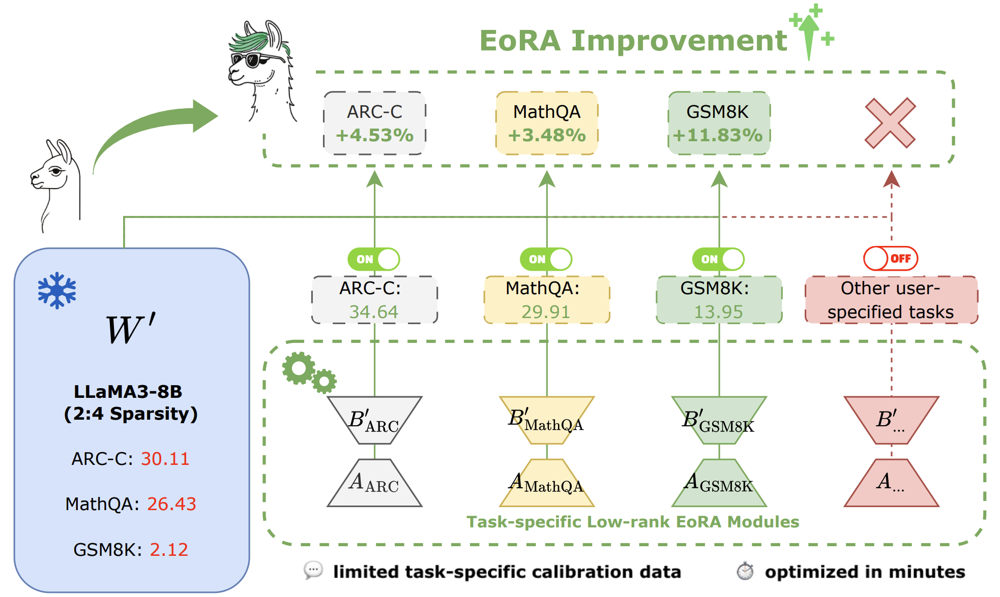

<h1 align="center">
    <p> EoRA: Fine-tuning-free Compensation for Compressed LLM with Eigenspace Low-Rank Approximation</p>
</h1>

<h1 align="center"> 
    
</h1>

[](https://github.com/NVlabs/EoRA/stargazers)

[Shih-Yang Liu*](https://nbasyl.github.io/), [Maksim Khadkevich](https://hutm.github.io/main.html), [Nai Chit FUNG](https://www.linkedin.com/in/naichit/), [Charbel Sakr](https://sakr2.web.engr.illinois.edu/), [Chao-Han Huck Yang](https://research.nvidia.com/person/huck-yang),[Chien-Yi Wang](https://chienyiwang.github.io/), [Saurav Muralidharan](https://www.sauravm.com/), [Hongxu Yin](https://hongxu-yin.github.io/), [Kwang-Ting Cheng](https://seng.hkust.edu.hk/about/people/faculty/tim-kwang-ting-cheng), [Jan Kautz](https://jankautz.com/), [Yu-Chiang Frank Wang](http://vllab.ee.ntu.edu.tw/ycwang.html),  [Pavlo Molchanov](https://www.pmolchanov.com/), [Min-Hung Chen](https://minhungchen.netlify.app/) <br>
(*Work done during the internship at NVIDIA Research)

[[`Paper`](https://arxiv.org/pdf/2410.21271)] [[`NV Blog`](https://developer.nvidia.com/blog/a-fine-tuning-free-approach-for-rapidly-recovering-llm-compression-errors-with-eora/)] [[`BibTeX`](#citation)]

EoRA is a novel fine-tuning-free method that augments compressed LLMs with low-rank matrices, allowing users to rapidly enhance task-specific performance and freely balance the trade-off between accuracy and computational overhead beyond the constraints of compression formats. EoRA consistently outperforms prior training-free low rank methods in recovering the accuracy of compressed LLMs, achieving notable accuracy improvements (e.g., **10.84%** on ARC-Challenge, **6.74%** on MathQA, and **11.45%** on GSM8K for LLaMA3-8B compressed to 3-bit). We also introduce an optimized CUDA kernel, accelerating inference by up to *1.4x* and reducing memory overhead through quantizing EoRA. Overall, EoRA offers a prompt solution for improving the accuracy of compressed models under varying user requirements, enabling more efficient and flexible deployment of LLMs.

For business inquiries, please visit our website and submit the form: [NVIDIA Research Licensing](https://www.nvidia.com/en-us/research/inquiries/).

## 💥 News 💥
- **[March 2, 2026]** 🔥🔥 EoRA is accepted to [**ICLR 2026**](https://iclr.cc/Conferences/2026) for both [ICBINB](https://sites.google.com/view/icbinb-2026/home) and [TTU](https://ttu-iclr2026.github.io/) workshops!! See you in Rio de Janeiro, Brazil!!
- **[June 13, 2025]** 🔥🔥 Release the code for reproducing the paper's results!!
- **[June 9, 2025]** 🔥🔥 The official NVIDIA Tech Blog of DoRA is released [HERE](https://developer.nvidia.com/blog/a-fine-tuning-free-approach-for-rapidly-recovering-llm-compression-errors-with-eora/)!!
- **[May 15, 2025]** 🔥🔥 Check out an awesome blog post [2-bit+EoRA](https://towardsdatascience.com/boost-2-bit-llm-accuracy-with-eora/) which shows that EoRA significantly boost 2-Bit LLM accuracy without training!!
- **[February 24, 2025]** 🔥🔥 EoRA has been integrated into GPTQModel [HERE](https://github.com/ModelCloud/GPTQModel/tree/main/examples/eora)!!


# 🔧 **GPTQModel Support**
## EoRA is now seamlessly integrated into GPTQModel([HERE](https://github.com/ModelCloud/GPTQModel)), Check [here](https://github.com/ModelCloud/GPTQModel/tree/main/examples/eora) for detailed instructions on running EoRA with GPTQModel.

## 🛠 Installation
```
# clone repo
git clone https://github.com/ModelCloud/GPTQModel.git && cd GPTQModel

# pip: compile and install
# You can install optional modules like autoround, ipex, vllm, sglang, bitblas, and ipex.
# Example: pip install -v --no-build-isolation .[vllm,sglang,bitblas,ipex,auto_round]
pip install -v . --no-build-isolation
```
## ⚡ Quick Start
### Step 1: Quantize the model with GPTQModel
```py
from datasets import load_dataset
from gptqmodel import GPTQModel, QuantizeConfig

model_id = "meta-llama/Llama-3.2-3B"
quant_path = "Llama-3.2-3B-gptqmodel-4bit"

calibration_dataset = load_dataset(
    "allenai/c4",
    data_files="en/c4-train.00001-of-01024.json.gz",
    split="train"
  ).select(range(1024))["text"]

quant_config = QuantizeConfig(bits=4, group_size=128)

model = GPTQModel.load(model_id, quant_config)

# increase `batch_size` to match gpu/vram specs to speed up quantization
model.quantize(calibration_dataset, batch_size=1)

model.save(quant_path)
```
### Step 2: Generate EoRA given the quantized model 
```py
from gptqmodel.adapter.adapter import Lora
from gptqmodel import GPTQModel, QuantizeConfig

eora = Lora(
  # for eora generation, path is adapter save path; for load, it is loading path
  path=f"{quant_path}/eora_rank16", 
  rank=16,
)

# provide a previously gptq quantized model path
GPTQModel.adapter.generate(
  adapter=eora,
  model_id_or_path=model_id,
  quantized_model_id_or_path=quant_path,
  calibration_dataset=calibration_dataset,
  calibration_dataset_concat_size=0,
  auto_gc=False)

# post-eora inference
model = GPTQModel.load(
  model_id_or_path=quant_path,
  adapter=eora
)
```

### Step 3: Evaluate the accuracy of the original quantized model vs EoRA
#### Evaluting the original quantized model
```
python GPTQModel/examples/eora/evaluation.py --quantized_model quant_path
```
#### Evaluting EoRA
```
python GPTQModel/examples/eora/evaluation.py --quantized_model quant_path \
    --eora_save_path {quant_path}/eora_rank32 \
    --eora_rank 16
```


# Reproducing Paper Results
You can find full reproduction instructions in the [EoRA](https://github.com/NVlabs/EoRA/tree/main/EoRA) directory.


## Star History

[](https://star-history.com/#NVlabs/EoRA&Date)


## Contact
Shih-Yang Liu: [shihyangl@nvidia.com](shihyangl@nvidia.com) or [sliuau@connect.ust.hk](sliuau@connect.ust.hk)

## Citation
If you find EoRA useful, please consider giving a star and citation:
```bibtex
@article{liu2024eora,
  title={Eora: Training-free compensation for compressed llm with eigenspace low-rank approximation},
  author={Liu, Shih-Yang and Khadkevich, Maksim and Fung, Nai Chit and Sakr, Charbel and Yang, Chao-Han Huck and Wang, Chien-Yi and Muralidharan, Saurav and Yin, Hongxu and Cheng, Kwang-Ting and Kautz, Jan and others},
  journal={arXiv preprint arXiv:2410.21271},
  year={2024}
}
```

## Licenses
Copyright © 2025, NVIDIA Corporation. All rights reserved.

This work is made available under the NVIDIA Source Code License-NC. Click [here](https://github.com/nbasyl/DoRA/LICENSE) to view a copy of this license.

